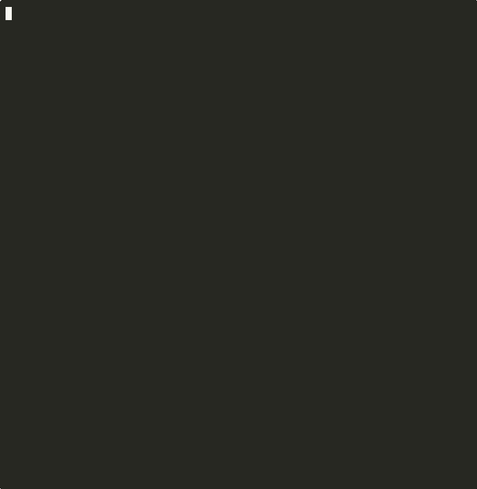
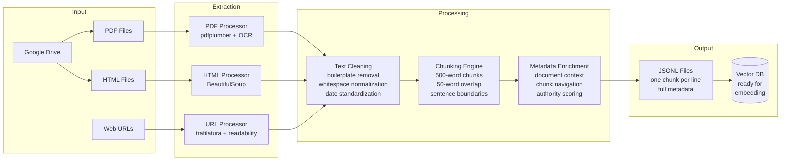

# rag-document-pipeline

[](https://github.com/salim-lakhal/rag-document-pipeline/actions/workflows/ci.yml)


Production-ready RAG preprocessing pipeline that extracts text from PDFs, HTML files, and web URLs, then transforms it into metadata-enriched JSONL chunks optimized for vector database ingestion and LLM retrieval.

## Demo

[](https://github.com/salim-lakhal/rag-document-pipeline/releases/download/v1.0/demo.mp4)

> *Click GIF to watch full quality video*

## Architecture



## Key Features

- **Multi-format extraction** — PDF (with OCR fallback via pytesseract), HTML (semantic tag detection), and web URLs (trafilatura → readability → BeautifulSoup cascade)
- **Intelligent chunking** — sentence-boundary-aware splitting with configurable overlap to preserve semantic context across chunk boundaries
- **Rich metadata propagation** — every chunk inherits document-level metadata (category, jurisdiction, authority score, source URL) for filtered retrieval
- **Pipeline orchestration** — metadata-driven batch processing with status tracking, error recovery, and incremental reprocessing
- **Google Drive integration** — OAuth 2.0 authenticated document fetching and HTML caching for reproducible extraction

## Pipeline Workflow

```
metadata.json (pending docs)
       │
       ▼
┌─────────────┐     ┌──────────┐     ┌──────────┐     ┌──────────┐
│  Download    │────▶│ Extract  │────▶│  Clean   │────▶│  Chunk   │
│  from Drive  │     │  Text    │     │  Text    │     │  500w/50 │
└─────────────┘     └──────────┘     └──────────┘     └──────────┘
                                                            │
       ┌────────────────────────────────────────────────────┘
       ▼
┌─────────────┐     ┌──────────────┐
│  Enrich     │────▶│ Write JSONL  │──▶ data/jsonl/<doc_id>.jsonl
│  Metadata   │     │ Update Status│
└─────────────┘     └──────────────┘
```

## JSONL Output Format

Each line in the output is a self-contained JSON object ready for embedding:

```json
{
  "chunk_id": "pref92_visa2025_001",
  "text": "The residence permit renewal process requires...",
  "document_id": "pref92_visa2025",
  "category": "residence_permit",
  "jurisdiction": "Hauts-de-Seine",
  "authority_score": 5,
  "language": "fr",
  "date": "2025-01-10",
  "source_url": "https://prefecture92.gouv.fr/visa-renewal",
  "chunk_size": 487,
  "overlap_prev": 50,
  "page_start": 1,
  "page_end": 2
}
```

## Getting Started

### Prerequisites

- Python 3.10+
- For OCR: `tesseract-ocr` and language packs (`sudo apt install tesseract-ocr tesseract-ocr-fra`)
- Google Cloud project with Drive API enabled (for remote document fetching)

### Installation

```bash
git clone https://github.com/salim-lakhal/rag-document-pipeline.git
cd rag-document-pipeline

python -m venv venv
source venv/bin/activate
pip install -e ".[dev]"
```

### Configuration

```bash
cp .env.example .env
# Edit .env with your Google Drive OAuth credentials
```

### Usage

```bash
# Process all pending documents
python scripts/pipeline_orchestrator.py

# Process a specific document
python scripts/pipeline_orchestrator.py --document-id pref92_visa2025

# Debug mode
python scripts/pipeline_orchestrator.py --log-level DEBUG

# Custom paths
python scripts/pipeline_orchestrator.py \
  --metadata-path data/meta/metadata.json \
  --output-dir data/jsonl
```

### Using Individual Components

```python
from utils.chunking import chunk_text, create_chunks_with_metadata
from utils.text_cleaning import clean_text
from utils.jsonl_writer import write_jsonl
from processors.html_processor import process_html

# Extract text from HTML
result = process_html("document.html", {"document_id": "doc_001"})

# Clean and chunk
cleaned = clean_text(result["text"])
chunks = create_chunks_with_metadata(
    cleaned,
    document_metadata={"document_id": "doc_001", "category": "legal"},
    chunk_size=500,
    overlap=50
)

# Write JSONL
write_jsonl(chunks, "output/doc_001.jsonl")
```

## Project Structure

```
rag-document-pipeline/
├── processors/
│   ├── pdf_processor.py          # PDF extraction + OCR fallback
│   ├── html_processor.py         # HTML content extraction
│   ├── url_processor.py          # Web URL fetching + extraction
│   └── url_processor_with_cache.py  # URL processing with Drive caching
├── utils/
│   ├── text_cleaning.py          # Boilerplate removal, date standardization
│   ├── chunking.py               # Sentence-aware chunking with overlap
│   ├── jsonl_writer.py           # JSONL I/O with validation
│   ├── metadata_manager.py       # Document metadata CRUD + status tracking
│   └── gdrive_client.py          # Google Drive API wrapper (OAuth 2.0)
├── scripts/
│   └── pipeline_orchestrator.py  # CLI entry point, end-to-end orchestration
├── tests/                        # 113 pytest tests
├── data/
│   ├── meta/metadata.json        # Document registry
│   └── jsonl/                    # Output chunks (gitignored)
├── pyproject.toml
└── .github/workflows/ci.yml
```

## Testing

```bash
# Run all unit tests (113 tests)
pytest -v

# Run with coverage
pytest --cov=utils --cov=processors

# Skip integration tests (require network)
pytest -m "not integration"
```

## Tech Stack

| Component | Technology |
|-----------|-----------|
| PDF extraction | pdfplumber, pytesseract (OCR) |
| HTML parsing | BeautifulSoup4, lxml |
| URL extraction | trafilatura, readability-lxml |
| Language detection | langdetect |
| Cloud storage | Google Drive API v3 |
| Testing | pytest (113 tests) |
| Linting | ruff |
| CI/CD | GitHub Actions |

## Design Decisions

- **500-word chunks with 50-word overlap** — balances retrieval precision with context preservation. Overlap prevents information loss at chunk boundaries, critical for legal documents where a single sentence can span clauses.
- **Sentence-boundary splitting** — chunks split at sentence endings rather than hard word counts, maintaining semantic coherence for downstream embedding models.
- **Authority scoring (1-5)** — enables retrieval-time filtering by source reliability. Official government documents (5) can be prioritized over unverified sources (1) during RAG generation.
- **Per-document JSONL** — each document produces its own JSONL file, enabling incremental processing and selective reindexing without full pipeline reruns.
- **Multi-tier URL extraction** — trafilatura → readability → BeautifulSoup cascade ensures maximum extraction coverage across different website structures.

## License

MIT
